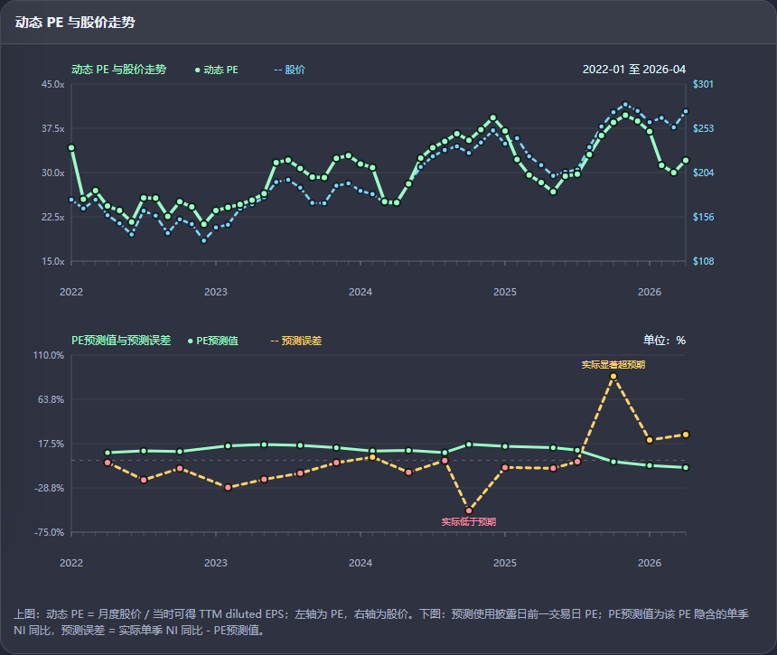

# 估值

这是一个本地 Python 研究仪表盘，核心模型是：

## 基于收益基准的 PE 隐含净利润路径模型

这个项目不是从主观预测未来净利润增长率开始，而是反过来使用市场已经给出的 PE，推导当前股价隐含了怎样的未来净利润路径。

项目目标是把公开 SEC 申报数据、市场 PE、账面股东权益、回购、分红和关键模型假设放在同一个框架里，让使用者能够区分：

- 哪些是来源数据
- 哪些是模型假设
- 哪些是计算结果
- 哪些只是估值诊断，不是投资结论

本项目用于研究和教学，不构成投资建议。

## 核心思路

传统估值通常先预测未来净利润增长率，再通过现金流或收益模型折现得到价值。但净利润增长率预测很主观，通常也不是一个点，而是一组敏感性假设。

这个模型反过来做：

1. 用市场 PE 和当前 TTM 净利润得到 PE 隐含市值。
2. 用期初股东权益和要求收益率得到基础收益。
3. 求解一个初始收益 spread，使模型价值等于 PE 隐含市值。
4. 用 `rho` 控制这个 spread 在未来年份中的衰减速度。
5. 用净利润、回购和分红滚动更新账面股东权益。
6. 根据每年股东权益和 spread 推导未来净利润。

PE 的估值口径是：

```text
PE = Market Value / Net Income
```

或按每股口径：

```text
PE = Share Price / EPS
```

ROE 不是这个模型的起点。ROE 只是净利润和股东权益之间的关系。模型真正反推的是：为了让当前 PE 成立，未来每年需要多少净利润。

## 图表示例

仪表盘会展示动态 PE、股价，以及 PE 隐含预测和实际结果之间的误差：



上图：

```text
动态 PE = 月度股价 / 当时可得 TTM diluted EPS
```

下图：

```text
PE预测值 = 该 PE 隐含的单季 NI 同比
预测误差 = 实际单季 NI 同比 - PE预测值
```

在财报节点复查中，预测使用的是**披露日前一交易日 PE**，避免使用财报披露之后才发生的价格信息。

## 关键假设

| 假设 | 含义 |
| --- | --- |
| 市场 PE | 把当前或历史 PE 转换成市场隐含价值。 |
| TTM 净利润 | 用于计算 `MV_PE = PE × TTM NI`。 |
| 账面股东权益 | 未来收益基准和账面价值滚动的起点。 |
| 要求收益率 `re` | 股东权益需要赚到的基础收益率。 |
| 初始 spread | 模型求解出来的收益溢价，使模型价值等于 PE 隐含价值。 |
| `rho` | spread 的持续性系数，越接近 1，衰减越慢。 |
| 回购 | 扣减未来账面股东权益，默认按 CPI 增长。 |
| 分红 | 扣减未来账面股东权益，默认按历史分红增长率估计。 |
| 终值增长率 | 显性预测期之后的长期增长假设。 |

其中最重要的是 `rho`。它决定市场给出的 PE 溢价被分配到更近的年份，还是更远的年份。

当前模型使用的是几何衰减：

```text
spread_t = spread_1 × rho^(t-1)
```

如果 `rho` 越接近 1，说明市场隐含的额外收益要求衰减较慢；如果 `rho` 越低，说明这部分溢价更多集中在前几年。

`rho` 不是直接拍脑袋设成 1，而是用历史经营稳定性进行惩罚。当前代码中的估计逻辑是：

```text
sales_stability = 1 - 平均|收入增速变化| / 8pp
gm_stability = 1 - 平均|毛利率变化| / 2pp
rho = 0.50 + 0.40 × sales_stability + 0.10 × gm_stability
```

并且 `sales_stability` 和 `gm_stability` 会被限制在 `[0, 1]` 区间内。

直觉上：

```text
历史越稳定 -> rho 越接近 1 -> spread 衰减越慢
历史越波动 -> rho 越接近 0.5 -> spread 衰减越快
```

## 公式顺序

| 顺序 | 公式 |
| --- | --- |
| 1. PE 隐含市值 | `MV_PE = PE × NI_0` |
| 2. 基础收益 | `收益_NI_t = re × BVE_(t-1)` |
| 3. spread 衰减 | `spread_t = spread_1 × rho^(t-1)` |
| 4. 推导净利润 | `NI_t = (re + spread_t) × BVE_(t-1)` |
| 5. 净利润增长率 | `g_t = NI_t / NI_(t-1) - 1` |
| 6. 股东权益滚动 | `BVE_t = BVE_(t-1) + NI_t - Buyback_t - Dividend_t` |
| 7. 显性期价值 | `PV_spread = sum[(spread_t × BVE_(t-1)) / (1 + re)^t]` |
| 8. 终值 | `TV = spread_(N+1) × BVE_N / (re - terminal_growth)` |
| 9. 估值恒等式 | `MV_PE = BVE_0 + PV_spread + TV / (1 + re)^N` |

这个模型不是直接预测收入、毛利率、税率或利息费用。历史收入、毛利率、净利润、回购和分红主要用于估计稳定性和资本回报假设；未来路径直接表现为 PE 隐含的净利润路径。

## 公开示例

运行一个使用简单数字的公开示例：

```powershell
python examples/return_pe_implied_example.py
```

示例输出：

```json
{
  "model": "基于收益基准的 PE 隐含净利润路径模型",
  "formula": "MV_PE = PE * NI_0; 收益_NI_t = re * BVE_(t-1); NI_t = (re + spread_t) * BVE_(t-1)",
  "assumptions": {
    "pe": 12.0,
    "net_income_ttm": 100.0,
    "market_value_pe": 1200.0,
    "opening_book_value_equity": 900.0,
    "cost_of_equity": 0.1,
    "rho": 0.75,
    "terminal_growth": 0.035
  },
  "solved_initial_spread": 0.0928,
  "first_three_years": [
    {
      "year": 1,
      "beginning_book_value": 900.0,
      "earnings_benchmark_ni": 90.0,
      "implied_net_income": 173.56,
      "implied_ni_growth": 0.7356,
      "ending_book_value": 1042.66
    },
    {
      "year": 2,
      "beginning_book_value": 1042.66,
      "earnings_benchmark_ni": 104.27,
      "implied_net_income": 176.87,
      "implied_ni_growth": 0.0191,
      "ending_book_value": 1187.71
    },
    {
      "year": 3,
      "beginning_book_value": 1187.71,
      "earnings_benchmark_ni": 118.77,
      "implied_net_income": 180.8,
      "implied_ni_growth": 0.0222,
      "ending_book_value": 1335.72
    }
  ],
  "model_value": 1200.0
}
```

这个例子不是公司推荐，只是展示 PE 如何被转换成一条市场隐含的净利润路径。

## 功能

- 基于收益基准的 PE 隐含净利润路径模型。
- 动态 PE 与股价走势图。
- 财报披露节点的 PE 预测值与预测误差复查。
- SEC EDGAR 财报查询，支持公司名或股票代码。
- 本地财报预览，支持搜索和缩放。
- 净利润、ROE、杠杆率、Altman Z-Score 等辅助财务诊断。
- 本地优先数据存储；下载的 SEC 文件和缓存不会提交到 Git。

## 快速开始

```powershell
git clone https://github.com/hongyizhu106-debug/Valuation.git
cd Valuation
$env:SEC_USER_AGENT="Your Name your.email@example.com"
python start_dashboard.py
```

打开：

```text
http://127.0.0.1:8010
```

SEC 请求应包含清晰的 User-Agent。你可以在页面表单中填写，也可以通过环境变量 `SEC_USER_AGENT` 设置。

## 命令行下载财报

```powershell
python scripts/fetch_sec_filings.py Apple --user-agent "Your Name your.email@example.com"
python scripts/fetch_sec_filings.py Microsoft --forms 10-Q --user-agent "Your Name your.email@example.com"
python scripts/fetch_sec_filings.py NVDA --latest-per-form 2 --user-agent "Your Name your.email@example.com"
```

下载文件保存在：

```text
data/sec_filings/<ticker>/<form>/<filing_date>_<accession_number>/
```

该目录不会进入公开仓库。

## 项目结构

```text
.
|-- app.py                         # 本地仪表盘和财务诊断
|-- start_dashboard.py             # 仪表盘启动脚本
|-- scripts/                       # SEC 下载和研究脚本
|-- valuation_methods/             # 估值计算辅助函数
|-- examples/                      # 可运行示例
|-- docs/images/                   # README 图表截图
|-- .github/                       # CI 和 PR 配置
|-- .agents/                       # agent 工作流说明
|-- pyproject.toml                 # 包元数据
|-- AGENTS.md                      # 项目协作规则
`-- README.md
```

内部笔记、本地参考资料、下载的财报、缓存文件和本地打包文件不会放入公开仓库。

## 验证

```powershell
python -m compileall -q app.py start_dashboard.py scripts valuation_methods examples
python examples/return_pe_implied_example.py
```

CI 会在 PR 和推送到 `main` 时运行相同的 smoke checks。

## 数据和风险边界

- 来源数据、模型假设、计算结果和结论需要分开看。
- 缺失数据应该标注出来，而不是用猜测填补。
- 市场价格和公司数据会变化，使用前应刷新数据。
- 模型输出是估值诊断，不是交易建议。

## License

This project is released under the MIT License.
